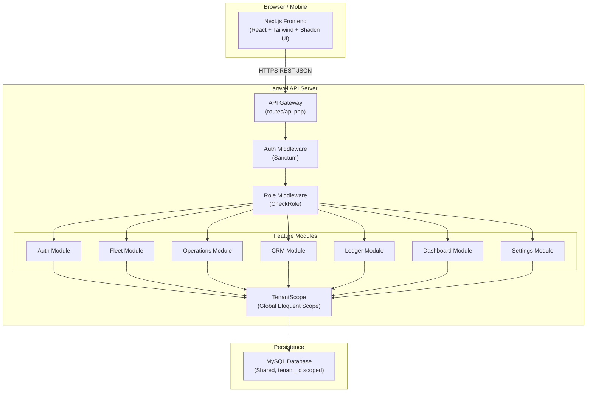
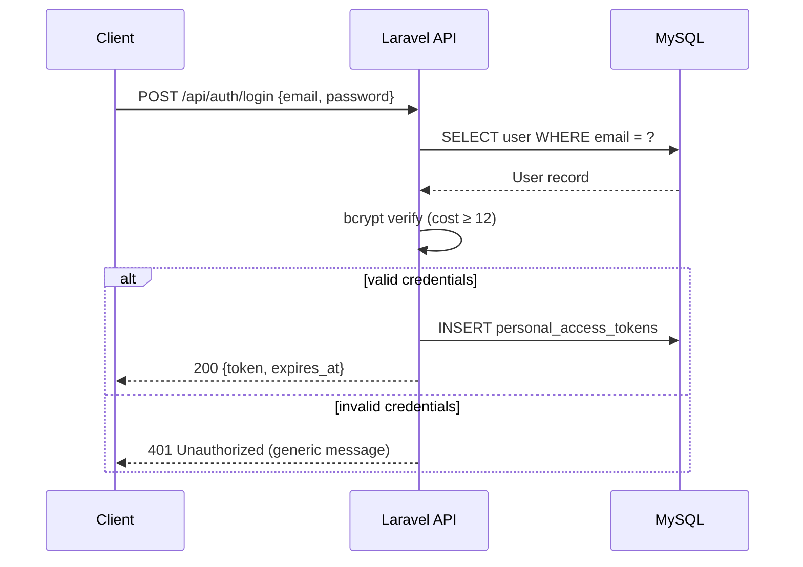
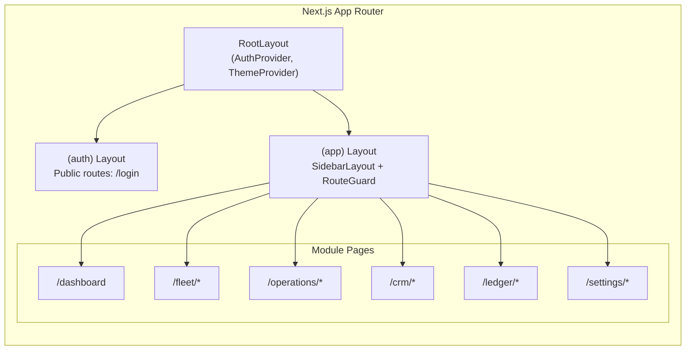
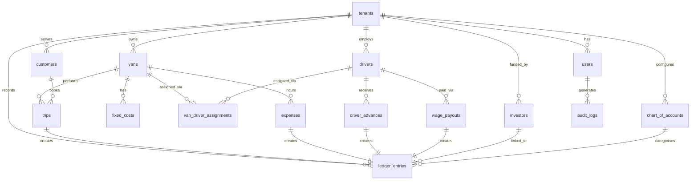

# Design Document — CX_COURIER Fleet Management & Courier Operations ERP

## Overview

CX_COURIER is a multi-tenant, web-based ERP platform for logistics businesses. It covers the full operational lifecycle: vehicle and driver management, daily trip and expense logging, client and investor relationship management, and automated double-entry financial reporting (Trial Balance, P&L, Balance Sheet).

The system is built as a decoupled full-stack application:

- **Backend**: Laravel 13 REST API (PHP 8.3), MySQL database, Laravel Sanctum token authentication, Eloquent ORM
- **Frontend**: Next.js (React), Tailwind CSS v4, Shadcn UI component library, Lucide Icons
- **Multi-tenancy**: Shared-database, separate-schema via `tenant_id` scoping on all core tables

All tenant data is isolated at the query layer via a `TenantScope` global Eloquent scope. Every API request is authenticated via a Sanctum token, and a `role` middleware guards each route group.

---

## Architecture

### High-Level Architecture



### Multi-Tenancy Strategy

- **Shared database, row-level isolation**: All tables include `tenant_id` (FK → `tenants.id`).
- **TenantScope**: A global Eloquent scope automatically appends `WHERE tenant_id = ?` to every query for scoped models.
- **Middleware**: `EnsureTenantScope` middleware resolves the tenant from the authenticated user and binds it to the request lifecycle.
- **403 guard**: A policy base class verifies `$record->tenant_id === $user->tenant_id` before any model-level operation.

### Authentication Flow



### Frontend Architecture



---

## Components and Interfaces

### Backend — Module Structure

```
app/
├── Http/
│   ├── Controllers/
│   │   ├── Auth/
│   │   │   └── AuthController.php
│   │   ├── Fleet/
│   │   │   ├── VanController.php
│   │   │   ├── FixedCostController.php
│   │   │   └── VanDriverAssignmentController.php
│   │   ├── Operations/
│   │   │   ├── TripController.php
│   │   │   ├── ExpenseController.php
│   │   │   ├── DriverAdvanceController.php
│   │   │   └── WagePayoutController.php
│   │   ├── CRM/
│   │   │   ├── CustomerController.php
│   │   │   ├── DriverController.php
│   │   │   └── InvestorController.php
│   │   ├── Ledger/
│   │   │   ├── ChartOfAccountController.php
│   │   │   ├── LedgerEntryController.php
│   │   │   ├── VanLedgerController.php
│   │   │   ├── CustomerLedgerController.php
│   │   │   ├── InvestorLedgerController.php
│   │   │   ├── TrialBalanceController.php
│   │   │   ├── ProfitLossController.php
│   │   │   └── BalanceSheetController.php
│   │   ├── Dashboard/
│   │   │   └── DashboardController.php
│   │   └── Settings/
│   │       ├── UserController.php
│   │       └── TenantSettingController.php
│   ├── Middleware/
│   │   ├── EnsureTenantScope.php
│   │   └── CheckRole.php
│   └── Requests/          (FormRequest validation classes per action)
├── Models/
│   ├── Tenant.php
│   ├── User.php
│   ├── Van.php
│   ├── FixedCost.php
│   ├── Driver.php
│   ├── VanDriverAssignment.php
│   ├── Customer.php
│   ├── Trip.php
│   ├── Expense.php
│   ├── DriverAdvance.php
│   ├── WagePayout.php
│   ├── Investor.php
│   ├── ChartOfAccount.php
│   ├── LedgerEntry.php
│   └── AuditLog.php
├── Scopes/
│   └── TenantScope.php
├── Policies/
│   └── TenantAwarePolicy.php
└── Services/
    ├── LedgerService.php
    ├── FinancialStatementService.php
    ├── WageCalculationService.php
    └── AuditService.php
```

### Frontend — Component Structure

```
frontend/  (separate Next.js project or monorepo package)
├── app/
│   ├── (auth)/
│   │   └── login/page.tsx
│   └── (app)/
│       ├── layout.tsx             ← SidebarLayout
│       ├── dashboard/page.tsx
│       ├── fleet/
│       │   ├── vans/page.tsx
│       │   ├── vans/[id]/page.tsx
│       │   ├── fixed-costs/page.tsx
│       │   └── assignments/page.tsx
│       ├── operations/
│       │   ├── trips/page.tsx
│       │   ├── expenses/page.tsx
│       │   ├── advances/page.tsx
│       │   └── wages/page.tsx
│       ├── crm/
│       │   ├── customers/page.tsx
│       │   ├── customers/[id]/page.tsx
│       │   ├── drivers/page.tsx
│       │   ├── drivers/[id]/page.tsx
│       │   └── investors/page.tsx
│       ├── ledger/
│       │   ├── chart-of-accounts/page.tsx
│       │   ├── van-ledger/page.tsx
│       │   ├── customer-ledger/page.tsx
│       │   ├── investor-ledger/page.tsx
│       │   ├── trial-balance/page.tsx
│       │   ├── profit-loss/page.tsx
│       │   └── balance-sheet/page.tsx
│       └── settings/
│           ├── users/page.tsx
│           └── tenant/page.tsx
├── components/
│   ├── layout/
│   │   ├── Sidebar.tsx
│   │   ├── SidebarGroup.tsx
│   │   ├── SidebarItem.tsx
│   │   ├── TopBar.tsx
│   │   └── MobileSidebarDrawer.tsx
│   ├── shared/
│   │   ├── DataTable.tsx          ← reusable paginated/sortable/filterable table
│   │   ├── KpiCard.tsx
│   │   ├── DateRangePicker.tsx
│   │   ├── ExportButton.tsx       ← CSV/PDF export
│   │   ├── LoadingSpinner.tsx
│   │   ├── ErrorBanner.tsx
│   │   ├── ConfirmDialog.tsx
│   │   └── FormModal.tsx
│   ├── charts/
│   │   └── RevenueExpenseBarChart.tsx
│   └── modules/                  ← module-specific form components
│       ├── fleet/
│       ├── operations/
│       ├── crm/
│       └── ledger/
├── lib/
│   ├── api.ts                     ← Axios/fetch wrapper with auth header injection
│   ├── auth.ts                    ← AuthContext + token management
│   └── formatters.ts              ← currency, date, percentage formatters
└── types/
    └── index.ts                   ← TypeScript interfaces mirroring API shapes
```

### Key API Contracts

All API responses follow a consistent envelope:

```json
// Success
{ "data": { ... }, "meta": { "page": 1, "per_page": 15, "total": 200 } }

// Error
{ "message": "Descriptive error", "errors": { "field": ["validation message"] } }
```

---

## Data Models

### Entity Relationship Diagram



### MySQL Table Definitions

#### `tenants`

| Column | Type | Notes |
|--------|------|-------|
| id | BIGINT UNSIGNED PK AI | |
| name | VARCHAR(255) NOT NULL | Company name |
| slug | VARCHAR(100) UNIQUE NOT NULL | URL-safe identifier |
| currency_code | CHAR(3) NOT NULL DEFAULT 'USD' | ISO 4217 |
| currency_symbol | VARCHAR(5) NOT NULL DEFAULT '$' | |
| tax_rate | DECIMAL(5,2) NOT NULL DEFAULT 0.00 | 0–100 |
| created_at | TIMESTAMP | |
| updated_at | TIMESTAMP | |

#### `users`

| Column | Type | Notes |
|--------|------|-------|
| id | BIGINT UNSIGNED PK AI | |
| tenant_id | BIGINT UNSIGNED FK→tenants.id | |
| name | VARCHAR(255) NOT NULL | |
| email | VARCHAR(255) UNIQUE NOT NULL | Scoped unique per tenant recommended via composite index |
| password | VARCHAR(255) NOT NULL | bcrypt, cost ≥ 12 |
| role | ENUM('admin','fleet_manager','accountant','driver') NOT NULL | |
| is_active | BOOLEAN NOT NULL DEFAULT TRUE | |
| created_at | TIMESTAMP | |
| updated_at | TIMESTAMP | |
| deleted_at | TIMESTAMP NULL | Soft delete |

Indexes: `(tenant_id, email)` UNIQUE, `(tenant_id, role)`

#### `vans`

| Column | Type | Notes |
|--------|------|-------|
| id | BIGINT UNSIGNED PK AI | |
| tenant_id | BIGINT UNSIGNED FK→tenants.id | |
| plate_number | VARCHAR(20) NOT NULL | Unique within tenant |
| make_model | VARCHAR(255) NOT NULL | |
| year | SMALLINT UNSIGNED NOT NULL | |
| status | ENUM('active','maintenance','leased') NOT NULL DEFAULT 'active' | |
| created_at | TIMESTAMP | |
| updated_at | TIMESTAMP | |
| deleted_at | TIMESTAMP NULL | Soft delete |

Indexes: `(tenant_id, plate_number)` UNIQUE, `(tenant_id, status)`

#### `fixed_costs`

| Column | Type | Notes |
|--------|------|-------|
| id | BIGINT UNSIGNED PK AI | |
| tenant_id | BIGINT UNSIGNED FK→tenants.id | |
| van_id | BIGINT UNSIGNED FK→vans.id | |
| monthly_lease | DECIMAL(12,2) NOT NULL DEFAULT 0.00 | |
| road_tax_annual | DECIMAL(12,2) NOT NULL DEFAULT 0.00 | Prorated monthly = /12 |
| insurance_monthly | DECIMAL(12,2) NOT NULL DEFAULT 0.00 | |
| next_service_date | DATE NULL | |
| created_at | TIMESTAMP | |
| updated_at | TIMESTAMP | |

Indexes: `(tenant_id, van_id)` UNIQUE

#### `drivers`

| Column | Type | Notes |
|--------|------|-------|
| id | BIGINT UNSIGNED PK AI | |
| tenant_id | BIGINT UNSIGNED FK→tenants.id | |
| full_name | VARCHAR(255) NOT NULL | |
| national_id | VARCHAR(100) NULL | |
| licence_number | VARCHAR(100) NOT NULL | |
| licence_expiry_date | DATE NOT NULL | |
| contact_number | VARCHAR(30) NULL | |
| emergency_contact | VARCHAR(255) NULL | |
| created_at | TIMESTAMP | |
| updated_at | TIMESTAMP | |
| deleted_at | TIMESTAMP NULL | Soft delete |

Indexes: `(tenant_id, licence_number)` UNIQUE

#### `van_driver_assignments`

| Column | Type | Notes |
|--------|------|-------|
| id | BIGINT UNSIGNED PK AI | |
| tenant_id | BIGINT UNSIGNED FK→tenants.id | |
| van_id | BIGINT UNSIGNED FK→vans.id | |
| driver_id | BIGINT UNSIGNED FK→drivers.id | |
| start_date | DATE NOT NULL | |
| end_date | DATE NULL | NULL = currently active |
| created_at | TIMESTAMP | |
| updated_at | TIMESTAMP | |

Indexes: `(tenant_id, van_id, end_date)` — partial unique where `end_date IS NULL` enforced at application layer

#### `customers`

| Column | Type | Notes |
|--------|------|-------|
| id | BIGINT UNSIGNED PK AI | |
| tenant_id | BIGINT UNSIGNED FK→tenants.id | |
| company_name | VARCHAR(255) NOT NULL | |
| contact_name | VARCHAR(255) NULL | |
| billing_address | TEXT NULL | |
| phone | VARCHAR(30) NULL | |
| email | VARCHAR(255) NULL | |
| credit_limit | DECIMAL(12,2) NOT NULL DEFAULT 0.00 | |
| created_at | TIMESTAMP | |
| updated_at | TIMESTAMP | |
| deleted_at | TIMESTAMP NULL | Soft delete |

Indexes: `(tenant_id, company_name)`

#### `trips`

| Column | Type | Notes |
|--------|------|-------|
| id | BIGINT UNSIGNED PK AI | |
| tenant_id | BIGINT UNSIGNED FK→tenants.id | |
| van_id | BIGINT UNSIGNED FK→vans.id | |
| customer_id | BIGINT UNSIGNED FK→customers.id | |
| trip_date | DATE NOT NULL | |
| origin | VARCHAR(255) NOT NULL | |
| destination | VARCHAR(255) NOT NULL | |
| fare_amount | DECIMAL(12,2) NOT NULL | Pre-tax |
| tax_amount | DECIMAL(12,2) NOT NULL DEFAULT 0.00 | Computed at save time |
| total_amount | DECIMAL(12,2) NOT NULL | fare + tax |
| status | ENUM('active','voided') NOT NULL DEFAULT 'active' | |
| ledger_entry_id | BIGINT UNSIGNED FK→ledger_entries.id NULL | |
| created_by | BIGINT UNSIGNED FK→users.id | |
| created_at | TIMESTAMP | |
| updated_at | TIMESTAMP | |

Indexes: `(tenant_id, trip_date)`, `(tenant_id, van_id)`, `(tenant_id, customer_id)`

#### `expenses`

| Column | Type | Notes |
|--------|------|-------|
| id | BIGINT UNSIGNED PK AI | |
| tenant_id | BIGINT UNSIGNED FK→tenants.id | |
| van_id | BIGINT UNSIGNED FK→vans.id | |
| chart_of_account_id | BIGINT UNSIGNED FK→chart_of_accounts.id | |
| expense_date | DATE NOT NULL | |
| amount | DECIMAL(12,2) NOT NULL | |
| description | TEXT NULL | |
| status | ENUM('active','deleted') NOT NULL DEFAULT 'active' | |
| ledger_entry_id | BIGINT UNSIGNED FK→ledger_entries.id NULL | |
| created_by | BIGINT UNSIGNED FK→users.id | |
| created_at | TIMESTAMP | |
| updated_at | TIMESTAMP | |

Indexes: `(tenant_id, expense_date)`, `(tenant_id, van_id)`, `(tenant_id, chart_of_account_id)`

#### `driver_advances`

| Column | Type | Notes |
|--------|------|-------|
| id | BIGINT UNSIGNED PK AI | |
| tenant_id | BIGINT UNSIGNED FK→tenants.id | |
| driver_id | BIGINT UNSIGNED FK→drivers.id | |
| van_id | BIGINT UNSIGNED FK→vans.id NULL | Assigned van at time of advance |
| advance_date | DATE NOT NULL | |
| amount | DECIMAL(12,2) NOT NULL | |
| purpose | VARCHAR(255) NULL | |
| pay_period | VARCHAR(7) NULL | Format: YYYY-MM |
| ledger_entry_id | BIGINT UNSIGNED FK→ledger_entries.id NULL | |
| created_by | BIGINT UNSIGNED FK→users.id | |
| created_at | TIMESTAMP | |
| updated_at | TIMESTAMP | |

Indexes: `(tenant_id, driver_id, pay_period)`

#### `wage_payouts`

| Column | Type | Notes |
|--------|------|-------|
| id | BIGINT UNSIGNED PK AI | |
| tenant_id | BIGINT UNSIGNED FK→tenants.id | |
| driver_id | BIGINT UNSIGNED FK→drivers.id | |
| pay_period | VARCHAR(7) NOT NULL | Format: YYYY-MM |
| gross_wage | DECIMAL(12,2) NOT NULL | |
| total_advances | DECIMAL(12,2) NOT NULL DEFAULT 0.00 | Snapshot at payout time |
| net_wage | DECIMAL(12,2) NOT NULL | gross - total_advances |
| is_negative | BOOLEAN NOT NULL DEFAULT FALSE | |
| confirmed_by | BIGINT UNSIGNED FK→users.id NULL | Required if net < 0 |
| ledger_entry_id | BIGINT UNSIGNED FK→ledger_entries.id NULL | |
| created_by | BIGINT UNSIGNED FK→users.id | |
| created_at | TIMESTAMP | |
| updated_at | TIMESTAMP | |

Indexes: `(tenant_id, driver_id, pay_period)` UNIQUE

#### `investors`

| Column | Type | Notes |
|--------|------|-------|
| id | BIGINT UNSIGNED PK AI | |
| tenant_id | BIGINT UNSIGNED FK→tenants.id | |
| full_name | VARCHAR(255) NOT NULL | |
| role | ENUM('investor','director') NOT NULL | |
| bank_account_name | VARCHAR(255) NULL | |
| bank_account_number | VARCHAR(50) NULL | |
| bank_name | VARCHAR(255) NULL | |
| initial_capital | DECIMAL(12,2) NOT NULL DEFAULT 0.00 | |
| created_at | TIMESTAMP | |
| updated_at | TIMESTAMP | |
| deleted_at | TIMESTAMP NULL | |

#### `chart_of_accounts`

| Column | Type | Notes |
|--------|------|-------|
| id | BIGINT UNSIGNED PK AI | |
| tenant_id | BIGINT UNSIGNED FK→tenants.id | |
| name | VARCHAR(255) NOT NULL | |
| type | ENUM('asset','liability','equity','revenue','expense') NOT NULL | |
| is_active | BOOLEAN NOT NULL DEFAULT TRUE | |
| is_system | BOOLEAN NOT NULL DEFAULT FALSE | System accounts cannot be deleted |
| created_at | TIMESTAMP | |
| updated_at | TIMESTAMP | |

Indexes: `(tenant_id, name)` UNIQUE

#### `ledger_entries`

| Column | Type | Notes |
|--------|------|-------|
| id | BIGINT UNSIGNED PK AI | |
| tenant_id | BIGINT UNSIGNED FK→tenants.id | |
| chart_of_account_id | BIGINT UNSIGNED FK→chart_of_accounts.id | |
| entry_date | DATE NOT NULL | |
| debit | DECIMAL(12,2) NOT NULL DEFAULT 0.00 | |
| credit | DECIMAL(12,2) NOT NULL DEFAULT 0.00 | |
| description | VARCHAR(500) NULL | |
| reference_type | VARCHAR(50) NULL | e.g. 'trip', 'expense', 'wage_payout' |
| reference_id | BIGINT UNSIGNED NULL | Polymorphic reference |
| investor_id | BIGINT UNSIGNED FK→investors.id NULL | For equity distributions |
| is_reversal | BOOLEAN NOT NULL DEFAULT FALSE | |
| reversed_entry_id | BIGINT UNSIGNED FK→ledger_entries.id NULL | Points to original |
| created_by | BIGINT UNSIGNED FK→users.id | |
| created_at | TIMESTAMP | |
| updated_at | TIMESTAMP | |

Indexes: `(tenant_id, entry_date)`, `(tenant_id, chart_of_account_id)`, `(reference_type, reference_id)`

#### `audit_logs`

| Column | Type | Notes |
|--------|------|-------|
| id | BIGINT UNSIGNED PK AI | |
| tenant_id | BIGINT UNSIGNED FK→tenants.id | |
| user_id | BIGINT UNSIGNED FK→users.id | |
| action | ENUM('create','update','delete','void') NOT NULL | |
| auditable_type | VARCHAR(100) NOT NULL | Model class name |
| auditable_id | BIGINT UNSIGNED NOT NULL | |
| before_values | JSON NULL | Snapshot before change |
| after_values | JSON NULL | Snapshot after change |
| created_at | TIMESTAMP | |

Indexes: `(tenant_id, auditable_type, auditable_id)`, `(tenant_id, created_at)`

---

## API Design

All routes are prefixed with `/api/v1` and protected by `auth:sanctum` + `tenant.scope` middleware unless noted.

### Authentication

| Method | Endpoint | Role | Description |
|--------|----------|------|-------------|
| POST | `/auth/login` | Public | Issue Sanctum token |
| POST | `/auth/logout` | Any | Revoke current token |
| GET | `/auth/me` | Any | Current user profile |

### Fleet Management

| Method | Endpoint | Role | Description |
|--------|----------|------|-------------|
| GET | `/vans` | Admin, Fleet Manager, Accountant | Paginated van list |
| POST | `/vans` | Admin, Fleet Manager | Create van |
| GET | `/vans/{id}` | Admin, Fleet Manager, Accountant | Van detail |
| PUT | `/vans/{id}` | Admin, Fleet Manager | Update van |
| DELETE | `/vans/{id}` | Admin, Fleet Manager | Soft-delete van |
| GET | `/vans/{id}/fixed-costs` | Admin, Fleet Manager, Accountant | Get fixed costs |
| POST | `/vans/{id}/fixed-costs` | Admin, Fleet Manager | Create/update fixed costs |
| GET | `/vans/{id}/assignments` | Admin, Fleet Manager | Assignment history |
| POST | `/vans/{id}/assignments` | Admin, Fleet Manager | Assign driver to van |

### Drivers

| Method | Endpoint | Role | Description |
|--------|----------|------|-------------|
| GET | `/drivers` | Admin, Fleet Manager, Accountant | Paginated driver list |
| POST | `/drivers` | Admin, Fleet Manager | Create driver |
| GET | `/drivers/{id}` | Admin, Fleet Manager, Accountant, Driver (own) | Driver detail |
| PUT | `/drivers/{id}` | Admin, Fleet Manager | Update driver |
| DELETE | `/drivers/{id}` | Admin | Soft-delete driver |

### Operations — Trips

| Method | Endpoint | Role | Description |
|--------|----------|------|-------------|
| GET | `/trips` | Admin, Fleet Manager, Accountant | Paginated trip list |
| POST | `/trips` | Admin, Fleet Manager | Create trip + LedgerEntry |
| GET | `/trips/{id}` | Admin, Fleet Manager, Accountant | Trip detail |
| PUT | `/trips/{id}` | Admin, Fleet Manager | Update trip |
| POST | `/trips/{id}/void` | Admin | Void trip + reverse LedgerEntry |

### Operations — Expenses

| Method | Endpoint | Role | Description |
|--------|----------|------|-------------|
| GET | `/expenses` | Admin, Fleet Manager, Accountant | Paginated expense list |
| POST | `/expenses` | Admin, Fleet Manager | Create expense + LedgerEntry |
| GET | `/expenses/{id}` | Admin, Fleet Manager, Accountant | Expense detail |
| PUT | `/expenses/{id}` | Admin, Fleet Manager | Update expense |
| DELETE | `/expenses/{id}` | Admin, Fleet Manager | Delete + reverse LedgerEntry |

### Operations — Driver Advances & Wages

| Method | Endpoint | Role | Description |
|--------|----------|------|-------------|
| GET | `/driver-advances` | Admin, Fleet Manager, Accountant | List advances |
| POST | `/driver-advances` | Admin, Fleet Manager | Record advance |
| DELETE | `/driver-advances/{id}` | Admin | Remove advance |
| GET | `/wage-payouts` | Admin, Accountant | List payouts |
| POST | `/wage-payouts/preview` | Admin, Accountant | Preview net wage (no save) |
| POST | `/wage-payouts` | Admin, Accountant | Save wage payout |

### CRM — Customers

| Method | Endpoint | Role | Description |
|--------|----------|------|-------------|
| GET | `/customers` | Admin, Fleet Manager, Accountant | Paginated list |
| POST | `/customers` | Admin, Fleet Manager | Create customer |
| GET | `/customers/{id}` | Admin, Fleet Manager, Accountant | Detail + balance |
| PUT | `/customers/{id}` | Admin, Fleet Manager | Update customer |
| DELETE | `/customers/{id}` | Admin | Soft-delete |

### CRM — Investors

| Method | Endpoint | Role | Description |
|--------|----------|------|-------------|
| GET | `/investors` | Admin, Accountant | List investors |
| POST | `/investors` | Admin | Create investor |
| GET | `/investors/{id}` | Admin, Accountant | Detail |
| PUT | `/investors/{id}` | Admin | Update |
| POST | `/investors/{id}/injections` | Admin, Accountant | Record capital injection |
| POST | `/investors/{id}/distributions` | Admin, Accountant | Record distribution |

### Ledger & Financial Reports

| Method | Endpoint | Role | Description |
|--------|----------|------|-------------|
| GET | `/chart-of-accounts` | Admin, Accountant | List accounts |
| POST | `/chart-of-accounts` | Admin, Accountant | Create account |
| PUT | `/chart-of-accounts/{id}` | Admin, Accountant | Update/deactivate |
| GET | `/ledger/van?van_id=&from=&to=` | Admin, Fleet Manager, Accountant | Van-wise ledger |
| GET | `/ledger/customer?customer_id=&from=&to=` | Admin, Accountant | Customer ledger |
| GET | `/ledger/investor?investor_id=&from=&to=` | Admin, Accountant | Investor ledger |
| GET | `/reports/trial-balance?from=&to=` | Admin, Accountant | Trial balance |
| GET | `/reports/profit-loss?from=&to=` | Admin, Accountant | P&L report |
| GET | `/reports/balance-sheet?as_of=` | Admin, Accountant | Balance sheet |

### Dashboard

| Method | Endpoint | Role | Description |
|--------|----------|------|-------------|
| GET | `/dashboard/kpis?from=&to=` | Admin, Fleet Manager | KPI summary |
| GET | `/dashboard/revenue-expenses?from=&to=` | Admin, Fleet Manager | Chart data |

### Settings

| Method | Endpoint | Role | Description |
|--------|----------|------|-------------|
| GET | `/settings/users` | Admin | Tenant user list |
| POST | `/settings/users` | Admin | Create user |
| PUT | `/settings/users/{id}` | Admin | Update / deactivate |
| GET | `/settings/tenant` | Admin | Tenant config |
| PUT | `/settings/tenant` | Admin | Update currency / tax |
| GET | `/audit-logs` | Admin, Accountant | Audit trail |

---

## Financial Calculation Logic

### Van-Wise Ledger

The Van-Wise Ledger aggregates financial data per van for a given date range:

```
Van Revenue   = SUM(trips.fare_amount) WHERE van_id = ? AND trip_date BETWEEN from AND to AND status = 'active'

Variable Expenses = SUM(expenses.amount) WHERE van_id = ? AND expense_date BETWEEN from AND to AND status = 'active'

Fixed Cost Proration:
  days_in_range   = to - from + 1
  days_in_month   = days in the calendar month(s) spanned
  prorated_lease  = monthly_lease × (days_in_range / days_in_full_period)
  prorated_tax    = (road_tax_annual / 12) × (days_in_range / days_in_full_period)
  prorated_ins    = insurance_monthly × (days_in_range / days_in_full_period)

Total Expenses = Variable Expenses + prorated_lease + prorated_tax + prorated_ins

Net Profit = Van Revenue - Total Expenses
```

### Wage Payout Calculation

```
Total Advances (period) = SUM(driver_advances.amount)
                          WHERE driver_id = ? AND pay_period = 'YYYY-MM'

Net Wage = Gross Wage - Total Advances

IF Net Wage < 0:
  flag is_negative = TRUE
  require Admin confirmation (confirmed_by = admin user id)
```

### Trial Balance

```
For each ChartOfAccount (where is_active = TRUE OR has historical entries):
  total_debit  = SUM(ledger_entries.debit)  WHERE chart_of_account_id = ? AND tenant_id = ? AND entry_date BETWEEN from AND to
  total_credit = SUM(ledger_entries.credit) WHERE chart_of_account_id = ? AND tenant_id = ? AND entry_date BETWEEN from AND to
  net_balance  = total_debit - total_credit

Grand Total Debit  = SUM(all total_debit)
Grand Total Credit = SUM(all total_credit)
Balanced = (Grand Total Debit == Grand Total Credit)
```

### Profit & Loss Report

```
Gross Revenue         = SUM(credit) WHERE coa.type = 'revenue' AND entry_date IN period
Total Expenses        = SUM(debit)  WHERE coa.type = 'expense' AND entry_date IN period
Net Profit / Loss     = Gross Revenue - Total Expenses
```

### Balance Sheet

```
Total Assets      = SUM(debit - credit) WHERE coa.type = 'asset'     AS OF date
Total Liabilities = SUM(credit - debit) WHERE coa.type = 'liability' AS OF date
Total Equity      = SUM(credit - debit) WHERE coa.type = 'equity'    AS OF date
                  + (Cumulative Net Profit up to date)

Reconciliation: Total Assets = Total Liabilities + Total Equity
```

### Double-Entry Ledger Rules

| Event | Debit Account | Credit Account |
|-------|--------------|----------------|
| Trip (revenue) | Accounts Receivable (Asset) | Revenue |
| Expense logged | Expense account (e.g. Fuel) | Cash/Bank (Asset) |
| Driver advance | Driver Advances (Expense) | Cash/Bank (Asset) |
| Wage payout | Driver Wages (Expense) | Cash/Bank (Asset) |
| Capital injection | Cash/Bank (Asset) | Capital (Equity) |
| Equity distribution | Equity Distributions | Cash/Bank (Asset) |
| Trip void (reversal) | Revenue | Accounts Receivable |

---

## Error Handling

### Backend Error Strategy

1. **Validation errors**: Laravel `FormRequest` returns `422 Unprocessable Entity` with field-level messages.
2. **Authentication failures**: `401 Unauthorized` with a generic message ("Invalid credentials") — never distinguishes username vs password.
3. **Authorization failures**: `403 Forbidden` — returned by `TenantAwarePolicy` for cross-tenant access or `CheckRole` middleware for role violations.
4. **Resource not found**: `404 Not Found` — returned by route model binding when record does not exist (or belongs to another tenant, to avoid enumeration).
5. **Business rule violations**: `422 Unprocessable Entity` with descriptive `message` field (e.g. van in maintenance status, negative net wage).
6. **Server errors**: `500 Internal Server Error` — sanitised message returned; full stack trace logged to Laravel log channel only.

### Frontend Error Strategy

1. **Network / server errors**: `ErrorBanner` component displays a user-readable message with a retry button.
2. **Form validation errors**: Field-level error messages displayed inline beneath each input using Shadcn UI `FormMessage`.
3. **Loading states**: `LoadingSpinner` overlays the affected table or form section during data fetches.
4. **Optimistic UI**: Not used for financial records — all mutations wait for server confirmation before updating UI state.
5. **Session expiry**: Axios interceptor catches `401` responses and redirects to `/login`, clearing the stored token.

---

## Testing Strategy

### Overview

The testing approach uses a two-layer strategy:

1. **Unit / example-based tests** (PHPUnit for backend, Vitest + React Testing Library for frontend): verify specific behaviours, edge cases, and error conditions.
2. **Property-based tests** (PHPUnit + `eris/eris` library for backend PHP): verify universal correctness properties across many generated inputs, with a minimum of **100 iterations per property**.

Each property test is tagged with a comment:
```
Feature: fleet-management-erp, Property {N}: {property_text}
```

### Backend Testing

- **Unit tests**: Service classes (`LedgerService`, `FinancialStatementService`, `WageCalculationService`) tested in isolation with in-memory models.
- **Feature tests**: API endpoint tests using Laravel's `RefreshDatabase` trait and HTTP test helpers.
- **Property tests**: `eris/eris` library generates random inputs for the financial calculation properties.
- **Tenant isolation tests**: Verify that requests with mismatched `tenant_id` always return `403`.

### Frontend Testing

- **Component tests**: Vitest + React Testing Library for shared components (`DataTable`, `KpiCard`, form validation).
- **Integration tests**: Key user flows (login → navigate → create trip → verify ledger) via Playwright E2E.
- **Snapshot tests**: Sidebar navigation structure and financial report layouts.

### Property-Based Testing Library

Backend: [`eris/eris`](https://github.com/giorgiosironi/eris) — a property-based testing library for PHP.

```php
// Example structure for a property test
use Eris\TestTrait;

class WageCalculationPropertyTest extends TestCase
{
    use TestTrait;

    // Feature: fleet-management-erp, Property 8: Net Wage Calculation Correctness
    public function test_net_wage_always_equals_gross_minus_advances(): void
    {
        $this->forAll(
            Generator\pos(), // grossWage: positive integer cents
            Generator\vector(Generator\pos(), Generator\choose(0, 10)) // advances array
        )->then(function (int $grossWageCents, array $advanceCents) {
            $grossWage     = $grossWageCents / 100;
            $totalAdvances = array_sum($advanceCents) / 100;
            $result        = WageCalculationService::compute($grossWage, $totalAdvances);

            $this->assertEqualsWithDelta(
                $grossWage - $totalAdvances,
                $result['net_wage'],
                0.001
            );
        });
    }
}
```


---

## Correctness Properties

*A property is a characteristic or behavior that should hold true across all valid executions of a system — essentially, a formal statement about what the system should do. Properties serve as the bridge between human-readable specifications and machine-verifiable correctness guarantees.*

---

### Property 1: Tenant Isolation — Record Ownership

*For any* core entity record (Van, Driver, Customer, Trip, Expense, LedgerEntry, DriverAdvance, WagePayout, Investor) created through the system, the `tenant_id` stored on that record SHALL equal the `tenant_id` of the authenticated user who created it.

**Validates: Requirements 1.1, 1.2**

---

### Property 2: Cross-Tenant Access Rejection

*For any* resource ID belonging to tenant B, a request authenticated as a user from tenant A (where A ≠ B) SHALL always receive an HTTP 403 Forbidden response, regardless of resource type, HTTP method, or role.

**Validates: Requirements 1.3**

---

### Property 3: Default Chart of Accounts Provisioning

*For any* newly registered tenant, the system SHALL provision exactly the 13 required default ChartOfAccount categories (Revenue, Fuel, Tolls, Spare Parts, Maintenance/Repairs, Monthly Lease, Road Tax, Insurance, Driver Wages, Driver Advances, Legal Cover, Capital, Equity Distributions), and every provisioned category SHALL have a unique `tenant_id` matching the new tenant.

**Validates: Requirements 1.4, 14.2**

---

### Property 4: Authentication Token Expiry Bound

*For any* user submitting valid credentials, the issued Sanctum token SHALL have an expiry timestamp that is at most 24 hours after the time of issuance, and the stored password hash SHALL be a valid bcrypt hash with a cost factor of no less than 12.

**Validates: Requirements 2.2, 2.6**

---

### Property 5: Credential Error Response Indistinguishability

*For any* login attempt with an invalid credential combination (wrong password only, wrong email only, or both wrong), the HTTP response code SHALL be 401 and the response body SHALL be identical — the system must not reveal which field was incorrect.

**Validates: Requirements 2.3**

---

### Property 6: Role-Based Access Control Enforcement

*For any* combination of (user role, API endpoint, HTTP method), the system SHALL grant or deny access exactly according to the RBAC permissions matrix defined in Requirement 2.4, and no role SHALL be able to perform an action outside its defined permission set.

**Validates: Requirements 2.4**

---

### Property 7: Operation-to-LedgerEntry Round Trip

*For any* Trip record saved with `status = 'active'`, the system SHALL create exactly one associated LedgerEntry with a credit to the Revenue account equal to the trip's `fare_amount`. Similarly, *for any* Expense record saved with `status = 'active'`, the system SHALL create exactly one associated LedgerEntry with a debit to the corresponding ChartOfAccount equal to the expense's `amount`. In both cases, querying the LedgerEntry by `reference_type` and `reference_id` SHALL return the record that corresponds to the originating Trip or Expense.

**Validates: Requirements 8.2, 9.2**

---

### Property 8: Ledger Reversal Preserves Immutability

*For any* Trip that is voided or Expense that is deleted, the system SHALL NOT delete the original LedgerEntry. Instead, it SHALL create a new offsetting LedgerEntry (is_reversal = TRUE) that negates the original. The sum of the original entry and its reversal entry for any given account SHALL equal zero.

**Validates: Requirements 8.3, 9.3, 23.3**

---

### Property 9: Net Wage Calculation Correctness

*For any* driver pay period with a gross wage G and a list of advances [a₁, a₂, …, aₙ], the computed net wage SHALL equal G − SUM(advances). When SUM(advances) > G, the `is_negative` flag SHALL be TRUE and the `confirmed_by` field SHALL be required to be non-null before the record is persisted.

**Validates: Requirements 10.4, 10.5**

---

### Property 10: Double-Entry Ledger Balance Invariant

*For any* sequence of financial operations performed through the system (trip creation, expense logging, wage payouts, capital injections, distributions) that each individually follow the double-entry rules, the Trial Balance for any date range SHALL satisfy: total debits = total credits. Furthermore, the Balance Sheet at any point in time SHALL satisfy: Total Assets = Total Liabilities + Total Equity.

**Validates: Requirements 18.1, 18.2, 19.1, 20.1, 20.2**

---

### Property 11: Audit Log Completeness

*For any* create, update, delete, or void operation performed on an audited model (Trip, Expense, LedgerEntry, WagePayout, DriverAdvance), the system SHALL produce exactly one AuditLog entry containing a non-null `user_id`, a `created_at` timestamp within 1 second of the operation, and non-null `before_values` (for updates and deletes) and/or `after_values` (for creates and updates) capturing the field state.

**Validates: Requirements 23.1**

---
